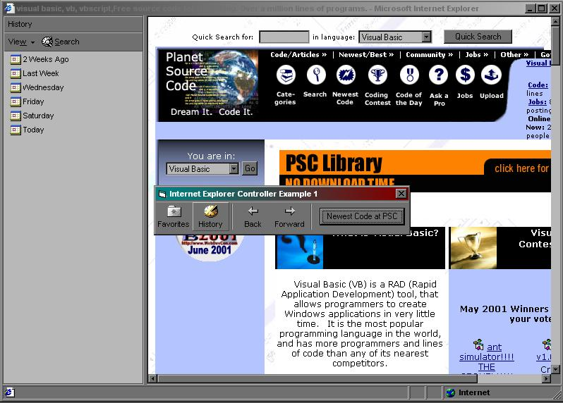



## Internet Explorer Controller Example 1

### Description

Control an instance of Internet Explorer. Shows how to go Back & Forward, Show Favorites & History Bars, and load a URL into a specific Frame (Example uses _self as the Frame Target)
 
### More Info
 

             |
---                |---
**Submitted On**   |2001-05-06 15:00:26
**By**             |[Chuck D](https://github.com/Planet-Source-Code/PSCIndex/blob/master/ByAuthor/chuck-d.md)
**Level**          |Beginner
**User Rating**    |4.5 (18 globes from 4 users)
**Compatibility**  |VB 6\.0
**Category**       |[Internet/ HTML](https://github.com/Planet-Source-Code/PSCIndex/blob/master/ByCategory/internet-html__1-34.md)
**World**          |[Visual Basic](https://github.com/Planet-Source-Code/PSCIndex/blob/master/ByWorld/visual-basic.md)
**Archive File**   |[Internet E19319562001\.zip](https://github.com/Planet-Source-Code/chuck-d-internet-explorer-controller-example-1__1-23007/archive/master.zip)

### API Declarations

Included in Zip

